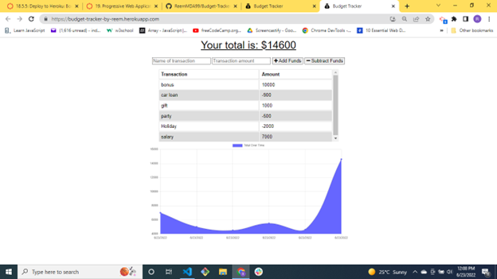
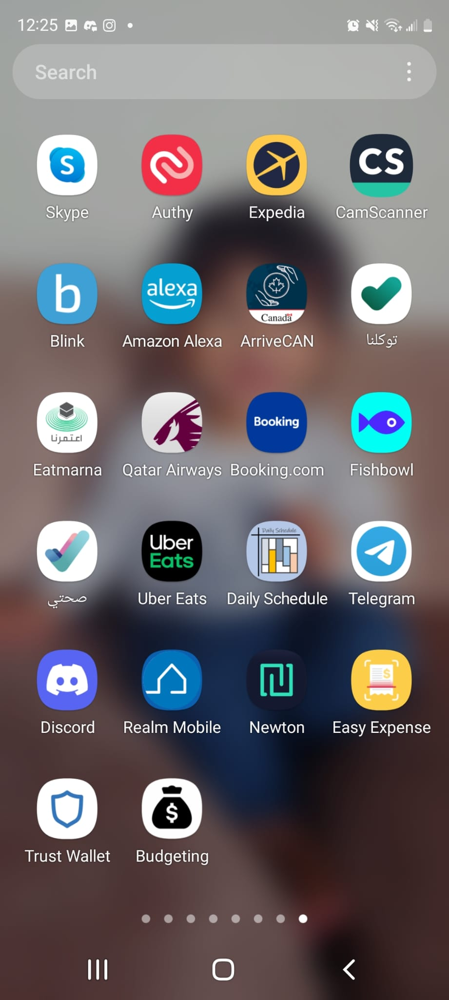
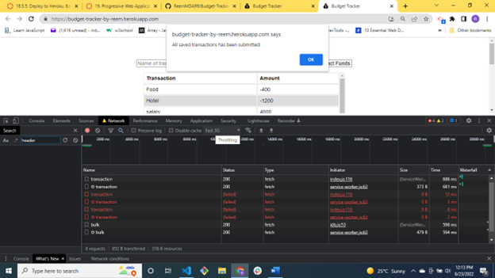
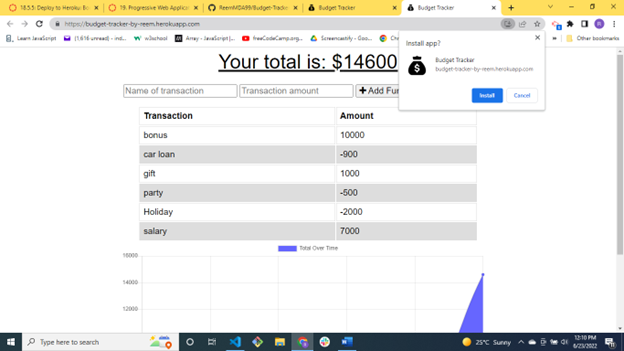

# Budget-Tracker-by-Reem

Application that allows users to add expenses and deposits to their budget with or without a connection.

## User Story

AS AN avid traveler
I WANT to be able to track my withdrawals and deposits with or without a data/internet connection
SO THAT my account balance is accurate when I am traveling 

## Acceptance Criteria

- GIVEN a budget tracker without an internet connection
- WHEN the user inputs an expense or deposit
- THEN they will receive a notification that they have added an expense or deposit
- WHEN the user reestablishes an internet connection
- THEN the deposits or expenses added while they were offline are added to their transaction history and their totals are updated.

## Screenshot

## Mobile Screen showing App Installed

## Technologies Used

- Node
- Express
- JavaScript
- MongoDB Atlas
- Heroku
- Mongoose
- IndexedDB
- Progressive Web Application
- Service worker

## Description

This project is an application that allows users to add expenses and deposits to their budget with or without a connection. If the user enters transactions offline, the changes will be reflected when they're brought back online. This application uses IndexDB, Service workers, and Web Manifest for offline functionality and is deployed on Heroku.

## Installation

- The user should clone the repository from GitHub
- Install dependencies. 
- To run server, run npm start.

## Usage

- Application will be invoked by using the following command:

`node server.js`

- Open your browser and go to

`http://localhost:3001`

- User can add transactions as deposits or expenses by inputting the following:

    - Name of transaction
    - Transaction amount
    - For deposits - select Add Funds
    - For expenses - select Subtract Funds

- The total amount is reflected as soon as funds are entered

- The graph portrays the total funds over time by date entered for each transaction.

- The app can be used online and offline

For Offline Functionality:

    - Enter deposits offline
    - Enter expenses offline
    - When brought back online:

- Offline entries should be added to tracker.

- There is also the option to download the app

## License

This project is license under MIT

## Contributing

Contributors should read the installation section.

## Submission

- Github Repo: https://github.com/ReemMDA99/Budget-Tracker-by-Reem

- Deployed link to Heroku: https://budget-tracker-by-reem.herokuapp.com/

## Questions

If you have any questions about this projects, please contact me directly at reem.mda0909@gmail.com. You can view more of my projects at https://github.com/ReemMDA99/Budget-Tracker-by-Reem